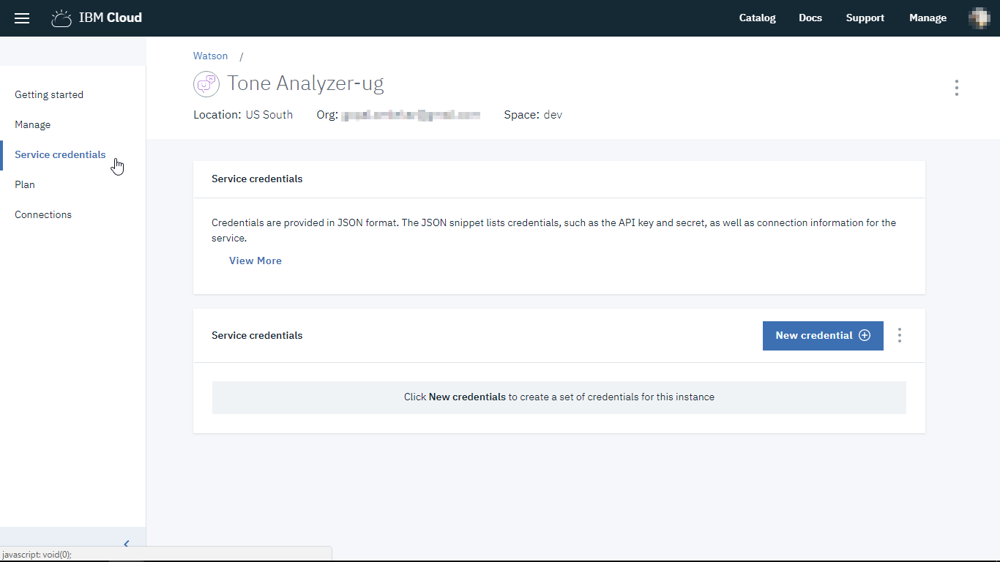
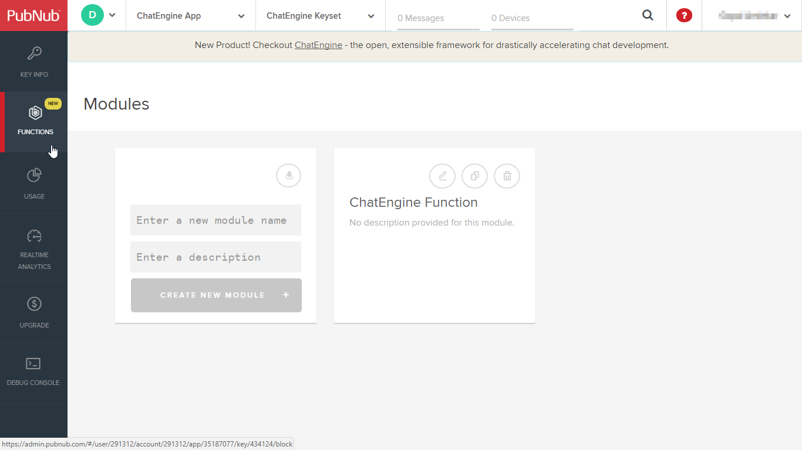

Setting up backend for the Tone Analyzer chat app using PubNub ChatEngine involves two major steps:

1. Setup Watson Tone Analyzer Service
2. Setup PubNub account with ChatEngine support

This file provides detailed steps to carry out the **backend** setup for Tone Analyzer chatbot using PubNub ChatEngine and IBM Watson Tone Analyzer service.

#### Prerequisites

Before you can create Watson Tone Analyzer Service, you need your own [IBM ID](https://console.bluemix.net/).  

You also need a developer account on [PubNub](https://admin.pubnub.com) to  create and configure PubNub function for accessing Watson Tone Analyzer service. Once you have created the accounts, follow the steps below.

#### Create Watson Tone Analyzer Service

##### Step 1

Log on to [IBM Cloud](https://console.bluemix.net/) with your IBM ID. Go to catalog, then select **Tone Analyzer** under Watson services.

##### Step 2

Enter a name for the service. Scrolling down, leave the pricing plan to 'Lite' and click on 'Create' button in the bottom right corner.

##### Step 3

Once the service is created, from the service page, go to 'Service credentials'. We need to create new credentials so click on 'New credential' button.

On the popup screen, enter a name for the credentials and leave other things default. Click on 'Add' button on the popup screen. Watson will create a new set of credentials for the Tone Analyzer service for you.

##### Step 4

On the service page, click on 'View credentials' which will show a json object with url, username and password for your service.
The username and password are unique to your service instance created. Make note of these as we will use them later while setting up the PubNub function.

This completes the creation of Watson Tone Analyzer Service. There is no need to configure this service specifically for our tutorial.

### Configure PubNub ChatEngine

Now that we have created a Tone Analyzer service on IBM Watson, your PubNub account needs to be configured with a couple of functions required for ChatEngine and also to access the Watson Language Translation service.

###### Step 5:

Login to [PubNub](https://admin.pubnub.com) with your credentials and then head to this link -[https://www.pubnub.com/docs/tutorials/chatengine#step-one-pubnub-keys](https://www.pubnub.com/docs/tutorials/chatengine#step-one-pubnub-keys). Click on the 'Setup' button on this page to let PubNub automagically create a new app with all required functions for the ChatEngine. Once the setup is done, a success message will be shown.

###### Step 6:

* Head back to your PubNub dashboard at https://admin.pubnub.com. You should see a new ChatEngine app created for you.

* Click on the app and you can see the publish, subscribe keys created for the app as well. Click on the keys.

* On the next screen, click the copy buttons towards right side of the keys and copy both publish and subscribe keys in a text file on your PC. We will use them later.

###### Step 7:

* From the left side bar, click on FUNCTIONS. You can see the function is already created for Chat Engine. Click on the function box.

* Within the function, two modules are already created and running. These are required for Chat Engine functionality. We need to create one more module within this function to access Watson Tone Analyzer service from within PubNub. Click on the '+CREATE' button which will pop-up a 'Create a New Function' dialog box.

###### Step 8:

* In the dialog box to create a new function module, enter a name, select trigger as 'Before Publish or Fire' and put an asterisk in the channel name box. Then click on 'CREATE' button on the dialog box.

###### Step 9:

* A new function will be created with a default code. Replace this default code with the code from file [chatbot-pubnub-function.js](watson-lt-function/watson-lt-function.js).

* Replace the Watson credentials in this code with your Watson Language Translation service credentials obtained in step 4 earlier.

* Save the newly created module by clicking on 'SAVE' button and then restart the module by clicking on 'Restart module' button.

This completes the backend setup for the Tone Analyzer chatbot app.