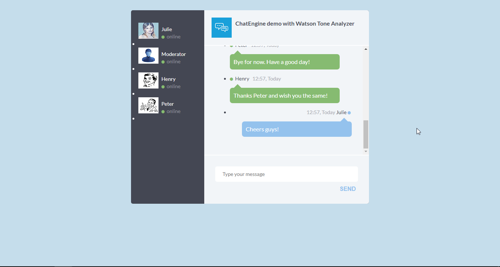
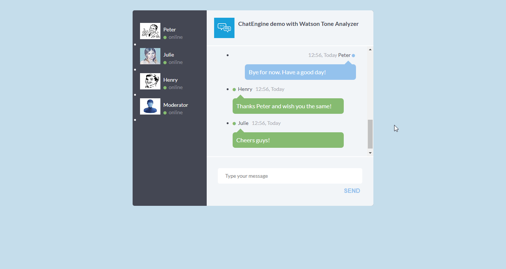
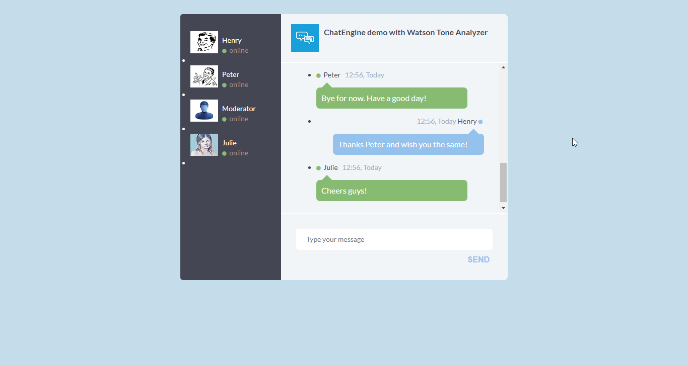
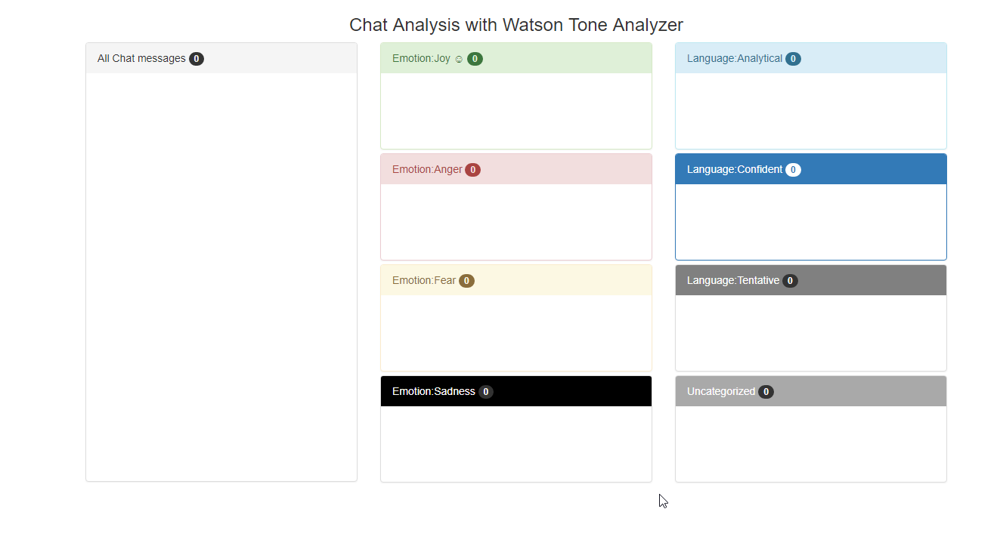
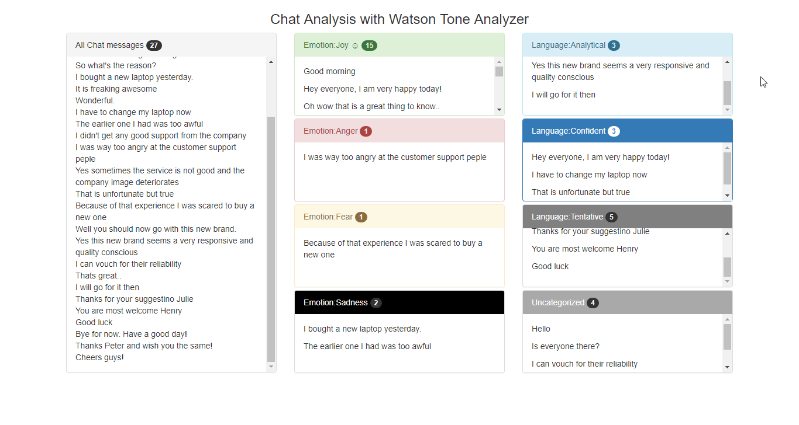

This file provides detailed steps to carry out the **frontend** setup for Tone Analyzer chatbot using PubNub ChatEngine and IBM Watson Language Translator service.

#### Prerequisites

* Before you can create Watson Language Translator Service, you need your own [IBM ID](https://console.bluemix.net/).  

* You also need a developer account on [PubNub](https://admin.pubnub.com) to  create and configure PubNub function for accessing Watson Language Translator service. Once you have created the accounts, follow the steps below.

* You must have completed the backend setup following instructions from [setup-backend.md](setup-backend.md) file.

### Configure PubNub ChatEngine

The PubNub microservice and Watson Language translator service are setup already if you followed the backend setup from file [setup-backend.md](setup-backend.md). The next and final steps are to run the chat app locally and see yourself the results of the tone conveyed in the chat messages.

###### Step 1:

* From the cloned GitHub repo on your computer, open file [chat.js](userapp-1/scripts/chat.js) from the `userapp-1/scripts` folder. Replace the publish, subscribe keys in the file with your own publish, subscribe keys obtained in step 6 of [setup-backend.md](setup-backend.md) file earlier. Save the file when done.

```javascript
pubnub_pub_key : 'YOUR_PUBNUB_PUBLISH_KEY';
pubnub_sub_key : 'YOUR_PUBNUB_SUBSCRIBE_KEY'
```

###### Step 2:

* Repeat step 13 for file `chat.js` from folders [userapp-2/scripts](userapp-2/scripts) and [userapp-3/scripts](userapp-3/scripts). All the `chat.js` files in these folders should have your PubNub publish, subscribe keys.

```javascript
pubnub_pub_key : 'YOUR_PUBNUB_PUBLISH_KEY';
pubnub_sub_key : 'YOUR_PUBNUB_SUBSCRIBE_KEY'
```


###### Step 3:

Now all your chat users are ready to chat. We need a moderator to see the analysis of chat messages being exchanged.
Open file [tone-analyzer-app/analyze.js](tone-analyzer-app/analyze.js) from the folder `tone-analyzer-app`. In this file again add your PubNub publish and subscribe keys and save the file.

```javascript
pubnub_pub_key : 'YOUR_PUBNUB_PUBLISH_KEY';
pubnub_sub_key : 'YOUR_PUBNUB_SUBSCRIBE_KEY'
```


###### Step 4:

Now, open the `chat.html` files from folders [userapp-1](userapp-1), [userapp-2](userapp-2) and [userapp-3](userapp-3) in different browser windows. You should see the chat app for each user. Subsequently you should also see different users online in each chat window.







These users can start chatting now.


###### Step 5:

Finally, open the file `index.html` from folder [tone-analyzer-app](tone-analyzer-app) in another browser window. This should launch with a webpage like this as shown below. 



Initially, it starts with no analysis as it doesn't look up the message history for analysis. Now when users start chatting, the messages are also read by this moderator and it will start populating the webpage with the tone analysis of the messages. After a while of chatting, the moderator web interface should look something like this.



As you can see, it shows all the messages in a single box and then also populates various tones boxes with respective sentences from the chat messges. When you hover mouse over a message, it shows the score of the tones as analyzed by Watson Tone Analyzer service. The count for each box also gets incremented as it receives a message in that category.


 You are done!
